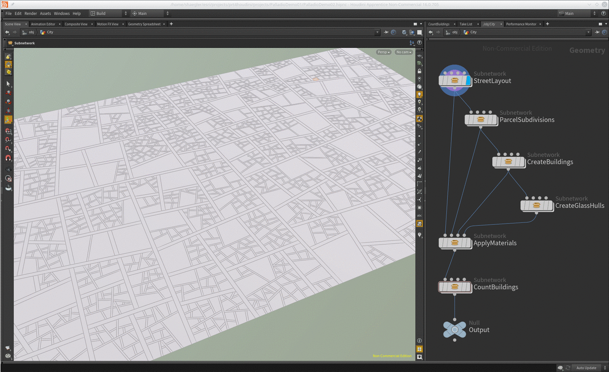
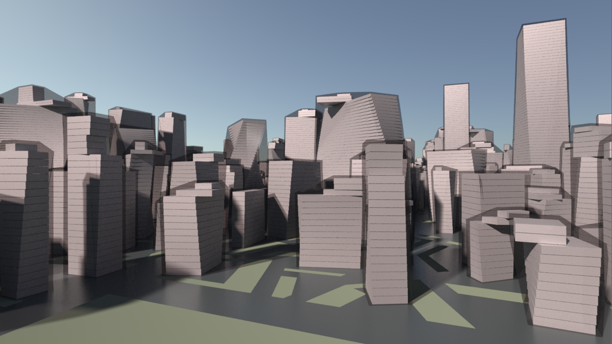
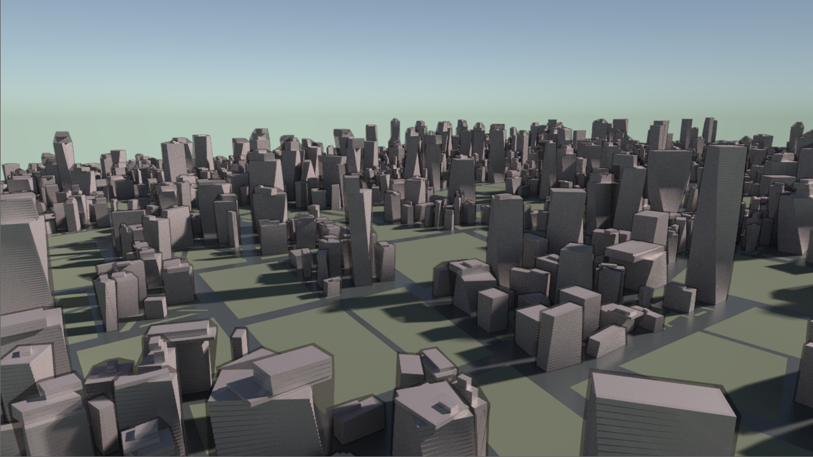

# Palladio Examples

## DemoProject01

This demo project shows how multiple rule packages can be used in sequence.

[Download Project](https://github.com/esri/palladio/releases/download/v1.0/PalladioDemo01.zip)

The above demo scene uses three CityEngine rule packages (RPK) chained in sequence, which is not possible with standalone CityEngine. The blue highlight denotes the actively visible node. The first RPK generates the street layout and parcels which are further subdivided by the second RPK. A third RPK creates the actual building volumes. Additionally, we use Houdini operators to create a convex "glass" hull (the shrink wrap) around the "leaf shapes" of the buildings, which is another thing CityEngine cannot do by itself. Each RPK execution step can emit additional attributes like unique building identifiers or material properties as Houdini primitive attributes. This is how the last step, "CountBuildings", is able to count the number of buildings in the scene.

