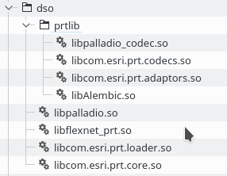
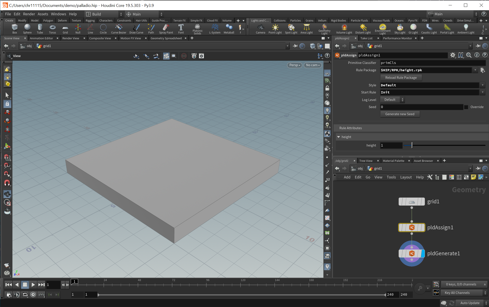
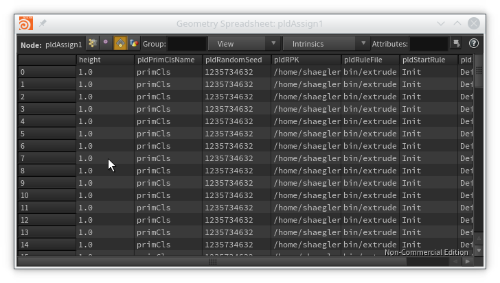

# Palladio Quick Start

## Prerequisites
* RHEL/CentOS 6/7 (or a compatible distribution)
* or Windows 7/8.1/10
* Houdini 16.5.x (including Apprentice edition)
* CityEngine 2017.x with valid Advanced license (node-locked or network)

## Execute a simple CityEngine Rule

1. [Build](build.md) Palladio
1. Verify that Palladio is installed and all necessary files are present in ``<User Home>/houdini16.5/dso``:

    
    
1. Windows only: ensure that the ``<User Home>/houdini16.5/dso`` and the `bin` subdirectory of your Houdini installation are on the `PATH`
1. In CityEngine, create the following rule file and share it as a rule package (RPK) to disk somewhere:
   ```
   attr height = 1
   
   @StartRule
   Init -->
      extrude(height)
   ```
1. Optional for CityEngine network license:
    ```
    export CITYENGINE_LICENSE_SERVER="27000@my.license.server"
    ```
1. Start Houdini in a bash console (adapt to your Houdini installation location):
    ```
    /opt/hfs16.5/bin/houdini
    ```
    (Use ``happrentice`` or ``hindie`` instead of ``houdini``, depending on our license.)
1. In a new scene, add a ``grid`` node.
1. Enter the ``grid`` node and add the two Palladio nodes ``pldAssign`` and ``pldGenerate``. Connect them like this: 
1. In the ``pldAssign`` node, set the ``Rule Package`` parameter to the path of the previously exported RPK.
1. Make the ``pldGenerate`` node the active render node, this will trigger a "cooking" of the assign and generate nodes and execute the CityEngine Rule. You should now see an extruded grid: 

## Overriding Rule Attributes

In the previous section we've used the default value for the ``height`` attribute. Let's use Houdini tools to modify the rule attribute prior to execution.

1. Right click on the ``pldAssign`` node and bring up the spreadsheet view. Observe how the ``height`` primitive parameter is set to 1 for all primitives. This is the rule attribute default value and we're going to override it now. 
1. Add an ``AttributeCreate`` node between ``pldAssign`` and ``pldGenerate``.
1. Set the attribute name to ``height`` and the ``Class`` to ``Primitive``. The extrusion vanishes because the default value is 0.
1. Increase the value for ``height`` to see an actual extrusion: 

## Working with Material Attributes

In this section, we are going to connect a material attribute generated by ``pldGenerate`` with a Mantra shader.

1. Extend the rule from the first section with a ``color`` statement:
    ```
    attr height = 1

    @StartRule
    Init -->
       color(1,0,0)
       extrude(height)
    ```
     
1. In Houdini, select the ``pldGenerate`` node and check the ``Emit material attributes`` check box. Open the spreadsheet to observe a number of material primitive attributes now being emitted by ``pldGenerate``.
1. Add a ``Material`` node and connect it to the ``pldGenerate`` node. Make it the active render node:
    
    
1. In the ``Material Palette``, create a new ``Principled Shader`` instance and call it ``CityEngineShader``:

    
1. Enter the ``CityEngineShader`` node and connect a ``Parameter`` node to the ``Surface/basecolor`` input:

     

1. Set the name of the ``Parameter`` node to ``color`` and also set the type to ``Color``. This name will match the primitive attribute emitted by ``pldGenerate``.

    

1. Back in the network of the ``grid`` node, select the ``Material`` node and select ``/mat/CityEngineShader`` for the ``Material`` parameter.

1. Hit Mantra render and you should see a red box in the render view.

    
